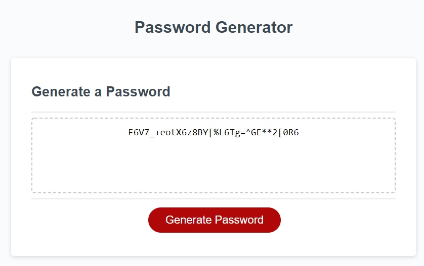

# Password Generator Starter Code

This javascript code generates a random password, after the user selects different character types to include in the generation. It also has checks to determine if the user accurately followed prompts or not.

## Screenshots
#### Website Preview

## Link 
The link to the deployed website can be found here:
[Random Password Generator ](https://tahir-arslan.github.io/Random-Password-Gen/)